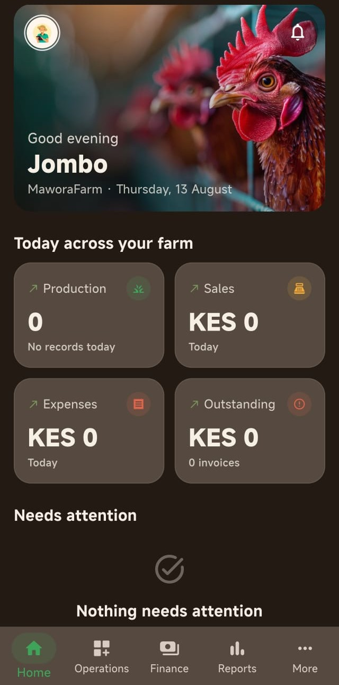
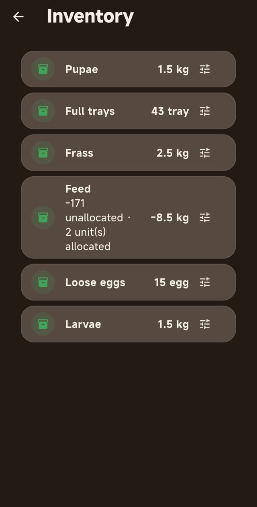
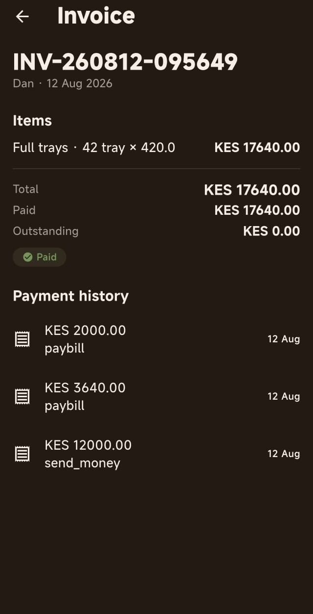
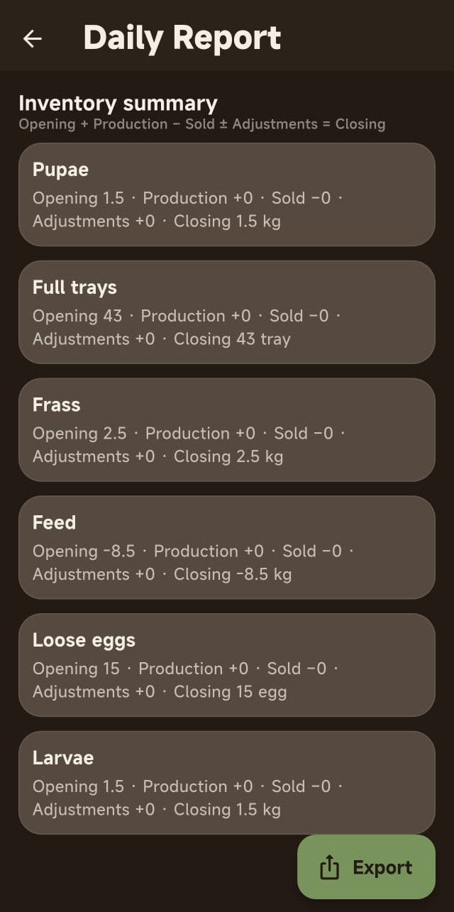
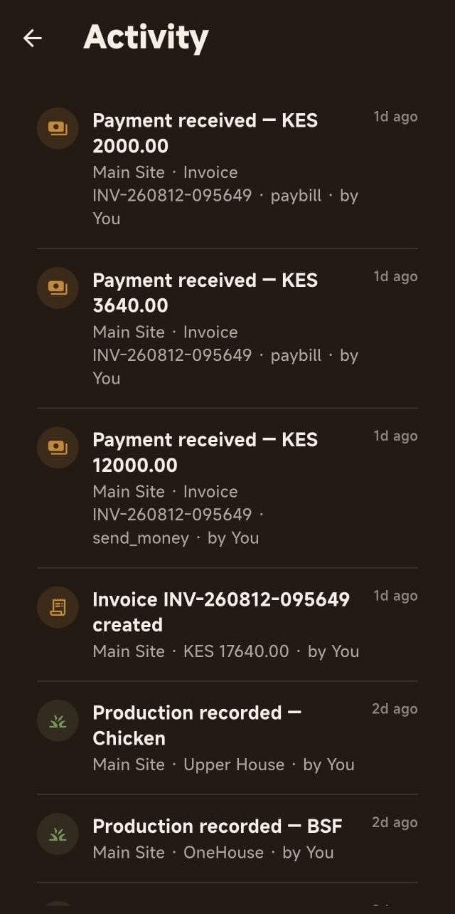

# Mawora

**Farm Operations and Management Platform**

Mawora is a mobile-first farm management application designed to help farm owners and field workers manage day-to-day agricultural operations from a single platform.

The system provides structured tools for recording production, managing inventory, creating and tracking invoices, recording payments and expenses, monitoring feed usage, generating reports and maintaining an auditable record of farm activity.

Mawora is designed for farms operating across multiple sites and supports configurable agricultural ventures and operational units rather than relying on a fixed farm structure.

---

## Download

The latest Android release is available from the GitHub Releases page.

[Download the latest APK](https://github.com/jomboi8/FarmOperationsRelease/releases/tag/v1.0.0)

The application is also intended for distribution through the Google Play Store.

---

## Screenshots

<div align="center">
<table>
  <tr>
    <td align="center">
      
      <br/>
      <sub>Home Dashboard</sub>
    </td>
    <td align="center">
      
      <br/>
      <sub>Inventory</sub>
    </td>
    <td align="center">
      
      <br/>
      <sub>Invoice</sub>
    </td>
  </tr>
  <tr>
    <td align="center">
      
      <br/>
      <sub>Daily Reports</sub>
    </td>
    <td align="center">
      
      <br/>
      <sub>Activity</sub>
    </td>
    <td align="center">
      
      <br/>
      <sub>Notifications</sub>
    </td>
  </tr>
</table>
</div>

---

## Overview

Mawora addresses the challenges of managing farm operations that are traditionally recorded using notebooks, spreadsheets and disconnected records.

The platform centralizes operational and financial information while maintaining a clear separation between farm sites, ventures and operational units.

The system is designed around four core principles:

* Accurate operational record keeping
* Continuous inventory tracking
* Financial accountability
* Clear visibility into farm performance

---

## Core Features

### Production Management

Record daily production at the appropriate farm site and operational unit.

Supported production records include:

* Egg production

  * Full trays
  * Individual eggs
  * Broken eggs
* Feed consumption
* Water consumption
* BSF egg harvesting
* BSF larvae harvesting
* BSF pupae harvesting
* BSF pupae added to Love Cages
* BSF frass production
* Moringa harvesting
* Bee-related notes and harvest records

Production records are date-stamped and associated with the relevant site and operational unit.

Workers can also edit production records from the previous day, while deletion of production records is restricted to the owner.

---

### Inventory Management

Mawora maintains inventory independently for each farm site.

Inventory includes:

* Eggs
* BSF products
* Moringa
* Feed
* Other configurable products

Egg inventory maintains separate quantities for:

* Full trays
* Loose eggs
* Broken eggs

Egg quantities can be represented using the farm's operational unit of trays, with 30 eggs equivalent to one tray where applicable.

Monthly inventory follows a continuous balance:

```text
Opening Balance
+ Production
- Sales
+/- Authorized Adjustments
= Closing Balance
```

The closing balance of one month becomes the opening balance of the next month.

Inventory transfers between sites are not supported.

Physical stock adjustments are restricted to the farm owner.

---

### Sales and Invoices

Mawora allows authorized users to create invoices for farm products.

Invoice items can include:

* Full egg trays
* Individual eggs
* Broken eggs
* BSF eggs
* BSF larvae
* BSF pupae
* BSF frass
* Moringa
* Other configured products

The system automatically calculates:

* Item totals
* Invoice total
* Amount paid
* Outstanding balance

Each sale is associated with an invoice number.

Workers can create invoices, while invoice modification is restricted to the owner.

---

### Payment Tracking

Payments can be recorded against invoices.

Supported payment information includes:

* Amount
* Payment method
* Payment reference/details
* Date
* Associated invoice

The system maintains the relationship between:

```text
Invoice
    |
    +-- Payments
    |
    +-- Amount Paid
    |
    +-- Outstanding Balance
```

Outstanding invoices are clearly identified for follow-up and reporting.

---

### Feed Management

Mawora provides dedicated feed management because feed represents both an operational resource and a significant farm expense.

The system can track:

* Feed purchases
* Supplier invoice numbers
* Purchase quantities
* Purchase costs
* Installment payments
* Available feed stock
* Feed allocated to individual chicken houses
* Daily feed consumption

This creates a relationship between:

```text
Feed Purchase
      |
      v
Farm Feed Inventory
      |
      v
House Allocation
      |
      v
Daily Consumption
```

Feed purchases are also incorporated into the farm's expense records.

---

### Expense Management

Farm expenses can be recorded with:

* Date
* Category
* Amount
* Description
* Site

Supported categories include:

* Bike maintenance
* Fuel
* Machicha
* Stipends
* Farm inputs
* Vaccinations
* Medicines
* Other

The expense system provides a structured financial record that can be used alongside sales and inventory reports.

---

### Reporting

Mawora provides operational and financial reporting at different time intervals.

Reports include:

* Daily reports
* Weekly reports
* Monthly reports
* Production reports
* Sales reports
* Expense reports
* Inventory summaries
* Outstanding invoice reports

Monthly summaries provide visibility into:

* Total production
* Total sales
* Opening inventory
* Closing inventory
* Outstanding invoices

---

### Multi-Site Management

The system is designed for farms operating across multiple sites.

A farm can contain multiple sites and each site can contain its own operational structure.

For example:

```text
Farm
├── Sunga
│   ├── Upper Chicken House
│   ├── Lower Chicken House
│   ├── BSF Unit
│   ├── Moringa
│   └── Beehives
│
└── Daraja
    ├── Chicken House
    ├── BSF Unit
    ├── Moringa
    └── Beehives
```

Sites and operational units are configurable rather than hardcoded.

---

### Configurable Farm Ventures

Mawora is not limited to a predefined list of agricultural activities.

The system is designed around configurable entities:

```text
Farm
  └── Site
       └── Venture
            └── Operational Unit
                 └── Products / Records
```

This allows a farm to configure ventures such as:

* Poultry
* Black Soldier Fly production
* Moringa
* Beekeeping
* Mango production
* Fishing
* Other future agricultural activities

The goal is to allow the platform to grow with the farm rather than requiring the application to be redesigned whenever a new venture is introduced.

---

### Worker Management

Mawora uses role-based access control.

#### Owner

The owner has full access to:

* Farm configuration
* Sites
* Ventures
* Operational units
* Workers
* Production
* Sales
* Invoices
* Payments
* Expenses
* Inventory
* Feed management
* Reports
* Activity history
* Inventory adjustments

#### Worker

Workers are assigned to a specific site and can:

* Record production
* Create invoices
* Record payments
* Record expenses
* View inventory
* View reports

Workers cannot:

* Delete production records
* Edit invoices
* Adjust inventory
* Manage workers
* Modify farm configuration

---

### Activity and Audit History

Mawora maintains an activity trail for important operations.

The system is designed to make it possible to determine:

* Who performed an action
* What was changed
* When it happened
* Which record was affected

This provides accountability across farm operations.

---

### Offline-First Operation

Farm operations cannot always depend on a stable internet connection.

Mawora is therefore designed around an offline-first workflow.

Users can:

1. Enter information without an internet connection.
2. Save the information immediately on the device.
3. Continue using the application.
4. Synchronize changes automatically when connectivity returns.

The experience is intended to feel similar to using applications such as WhatsApp where the user does not have to stop working simply because connectivity is temporarily unavailable.

The application also exposes synchronization status so users can distinguish between locally saved and synchronized information.

---

## User Access Model

```text
                         Mawora
                           |
                 +---------+---------+
                 |                   |
               Owner              Worker
                 |                   |
          Full farm access      Assigned site
                 |                   |
       +---------+---------+     +---+---------+
       |         |         |     |     |       |
    Config    Finance   Reports Production Sales
       |         |         |     |     |       |
    Workers  Inventory  Audit   Expenses Payments
```

There is one owner for the current farm model.

Workers are invited by the owner and assigned to a specific site.

---

## Technical Architecture

### Authentication

Mawora uses email-based OTP authentication.

Worker invitations are associated with the worker's email address and site assignment.

Deep links / app links are used to provide an in-app invitation acceptance experience when the application is installed.

---

## Design Approach

The application follows a field-oriented design philosophy.

The interface prioritizes:

* Large touch targets
* Short data-entry flows
* Clear numerical inputs
* Strong site context
* Minimal navigation during field operations
* Clear financial status
* Explicit synchronization status
* Consistent visual hierarchy

The visual language uses an earthy brown and neutral palette to reflect the agricultural environment while maintaining a modern application interface.

---

## Project Structure

The application is organized around independent feature modules.

```text
lib/
├── app/
│   ├── router/
│   └── theme/
│
├── core/
│   ├── errors/
│   ├── offline/
│   ├── permissions/
│   └── widgets/
│
├── features/
│   ├── auth/
│   ├── dashboard/
│   ├── production/
│   ├── sales/
│   ├── payments/
│   ├── inventory/
│   ├── feed/
│   ├── expenses/
│   ├── reports/
│   ├── farm_config/
│   ├── workers/
│   ├── notifications/
│   ├── activity/
│   └── settings/
│
└── shared/
    ├── models/
    └── widgets/
```

The architecture separates presentation, application logic, repositories and data sources to keep the system maintainable as the number of farms and configurable ventures grows.

---

## Development Status

Mawora is currently under active development.

| Area                    | Status      |
| ----------------------- | ----------- |
| Requirements analysis   | Completed   |
| System design           | Completed   |
| UX architecture         | Completed   |
| UI design system        | Completed   |
| Flutter implementation  | Completed   |
| Offline synchronization | Completed   |
| Testing                 | Completed   |
| Production deployment   | Planned     |

---

## Project Objectives

Mawora is being developed to replace fragmented manual farm records with a centralized operational system that provides:

* Better production visibility
* Reliable inventory balances
* Clear financial records
* Improved accountability
* Site-level operational visibility
* Reduced manual calculation errors
* Historical reporting
* Offline field data entry

The long-term objective is to provide a configurable platform capable of supporting different farm structures and agricultural ventures without requiring the underlying application to be rebuilt for every farm.

---

## License
MIT
